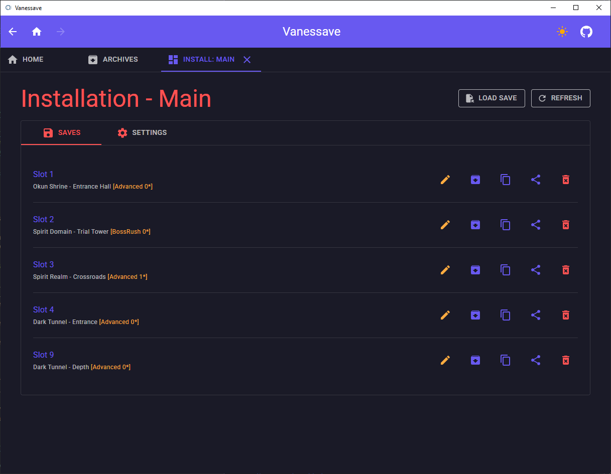
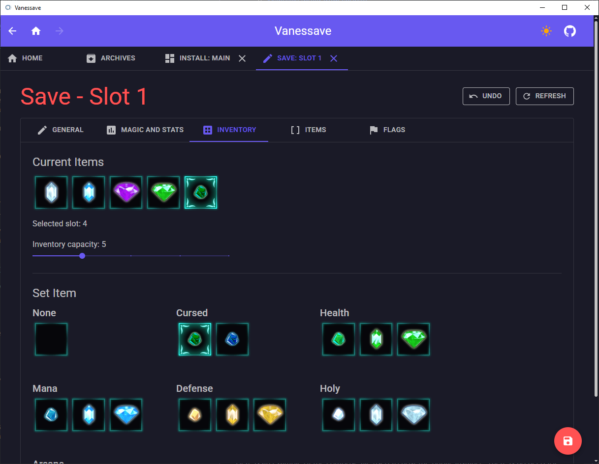

# Vanessave

> A **Little Witch Nobeta** save and settings editor

# Documentation

- [Usage](#usage)
- [Features](#features)
- [Compatibility](#compatibility)
- [Self-Hosting](#self-hosting)
  - [Building](#building)
- [Bug report and help](#bug-report-and-help)
- [Contributing](#contributing)
- [Used libraries](#used-libraries)
- [Licence](#licence)

## Usage

This save editor can be either used as a desktop app to modify your saves directly or by using the website that allows to modify copies of your saves.
- The desktop app can be downloaded on the [Releases](/../../releases) page for Windows and Linux
- The web application can be found at [this address](https://vanessave.ilysix.fr)

> The documentation for the web application is in the [Vanessave](./Vanessave/) directory

Here are the instructions to use the desktop version of the save editor:
- Start the app and click on the "Add game installation" button
- Find the installation directory of the game *(Usually in `steamapps/common`, you can find this from the game properties in steam -> local files -> browse...)*
- Select the game executable *(LittleWitchNobeta.exe)*
- Now you can open your game installation and edit saves, system settings and savestates (if using the trainer)

## Features

This save editor can modify nearly all properties of a save via specialized user interfaces with the exception of unlocked save points and dropped items.  

> Example of the inventory editor

In addition to a complete save editor, the desktop app is able to:
- Archive, copy, share and delete game saves
- Load any save into any slot (can be game saves, archived saves or savestates)
- Edit game system settings for a game installation (change skin, reset achievements, ...)
- Load and import saves
- Open single saves for edition (not from a game installation)

## Compatibility

The save editor should work for any version of the game but no special compatibility support is provided for older save formats.

## Self-Hosting

If you would prefer to use your own instance of the save editor *(or in case the public one is down)*, you can either use Docker or build from source.

### Building

To build and run the save editor from source, a few steps are required:
- Clone this repository and make sure .Net 8.0 SDK is installed
- Use the command `dotnet run` inside the project folder *(where `Vanessave.Desktop.csproj` is located)*
- This will build and run application

## Bug report and help

If you found a bug, need help with the save editor or want to suggest a new feature, you can either [open a new issue](/../../issues) or you can find me on the [Little Witch Nobeta Speedruns Discord](https://discord.gg/3FMeB4m).

## Contributing

This repository accepts contributions, don't hesitate to [open a new issue](/../../issues) before doing a pull request for major changes or new features.

## Used libraries

This save editor tool couldn't be made without these awesome libraries and tools:
- [Humanizer](https://github.com/Humanizr/Humanizer) - *licensed under the MIT license*
- [MudBlazor](https://github.com/MudBlazor/MudBlazor) - *licensed under the MIT license*
- [NativeFileDialogs.NET](https://github.com/Speykious/NativeFileDialogs.NET) - *licensed under the Zlib license*
- [Photino.Blazor](https://github.com/tryphotino/photino.Blazor) - *licensed under the Apache-2.0 license*
- [Toolbelt.Blazor.HotKeys2](https://github.com/jsakamoto/Toolbelt.Blazor.HotKeys2) - *licensed under the MPL-2.0 license*

## Licence

*This software is licensed under the [MIT license](LICENSE), you can modify and redistribute it freely as long as you respect the respective [Used libraries](#used-libraries) licenses*
